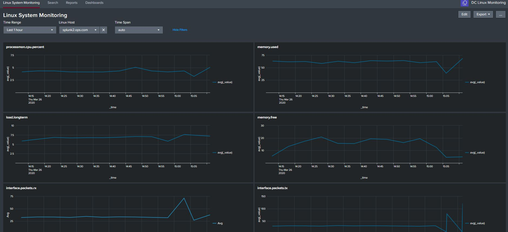

Linux Monitoring

This apps provides basic Linux Server Monitoring

Its design to check on a small number of CRITICAL servers, so you can use this with the free version of Splunk and it wont cost anything. You can also use it in a production enviroment, but keep a check on the volume of data and you will need to adjust the polling collection of metric data.

For this app, I have set the polling for every 5 minutes and based it on averages, this is best and most optimised way of getting some metric data in quickly, collected and viewing that data. Do you really need every second, from 1000's of servers...some do, but then we would have to think about the architecture, data volumes, etc....For now this app will get you started very quickly.

The Metrics I'm collecting are as follows and are based on averages, you will be able
to determine the servers health very quickly with this app.

CPU – It is crucial to monitor CPU, as it can reach a high utilization

Load – This specifies whether the CPU is being used, how much is being executed, and how long    it has been running.

Disk Capacity and IO – Disk capacity is especially important when it comes to file servers, data bases, Splunk servers, it can directly affect system OS and corrupt the operating system, or cause extreme IO slowness.

Network – It's extremely important to monitor network performance as input and output of data packets. With network performance, you can measure the utilization of the card and see whats taking up lots o bandwidth

Memory – Memory is used by many applications and is a key componenet for the proper function of providing services

Swap Memory – This is virtual memory created by the system and allocated to disk to be used when 
necessary. Its high utilization can indicate that the amount of memory for the server is     insufficient.

The ping check is designed to run every 10 minutes, this is fine as sometimes you will reboot servers, but any that do go offline, you will see the status in the dashboard.

Dashboard Features:

- cpu.system
- load.longterm
- memory.used
- memory.free
- df.free
- disk.io
- interface.packets.rx
- interface.packets.tx
- processmon.cpu.percent

Application Features:

- Uses metrics indexes - optimsed for metric data
- Uses the Analytics Workspace (Only available with Splunk 7.1 +) - SO Upgrade!

Data Config:
- Metric Data 
- data kept for 14 days
- index=linux_metric
- index size = 500MB

Script for Data:-

The app uses the TA-linux-metrics app, this uses a number of shell scripts, yes good old shell scripts....to collect the metric data and send them to the metrics index. You dont need collectd or any thirdparty tool, just deploy the TA-linux-metrics app to the target servers running the UF

Install:

This app should be installed only on a Search Head, or All in one Splunk instance, the indexes.conf file needs to be deployed to the indexing layer or all in one server

It was only tested on Splunk on Linux, so will not work on Splunk Windows

Download the zip and extract the file, copy the DC_ping_check folder to the Splunk Server
sudo cp -R DC_linux_monitoring /opt/splunk/etc/apps
sudo chown -R splunk:splunk /opt/splunk/etc/apps
sudo -u splunk /opt/splunk/bin/splunk restart

Config:

The polling can be adjusted in the inputs.conf in the TA-linux-metrics

- index=linux_metrics

You will need to run chmod +x for the shell scripts to run /bin

Use:
Login to Splunk and go DC_linux_monitoring app and select dashboards, select the host and you should see the you should see data, this is providing you have installed the TA-linux-metrics onto the target linux servers.
